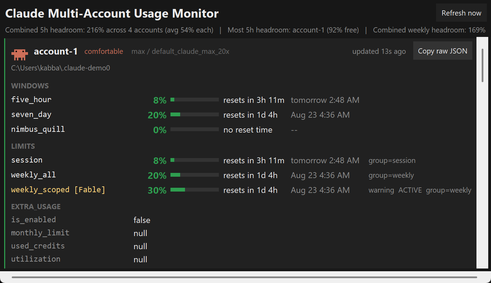

# Clauculate

A system-tray app that shows rate-limit usage across several Claude accounts at
once. It reads each account's usage and displays it. That is all it does.



---

## ⚠️ Read this first

This app depends on two **undocumented endpoints** —
**`/api/oauth/usage`** for the numbers and **`/api/oauth/profile`** for account
identity. Neither is a published API, neither carries any
compatibility promise, and Anthropic can change their shape, their auth
requirements, or remove them entirely at any time and without notice. When that
happens this app will show errors or raw JSON rather than numbers.

The app is built to degrade rather than lie: an unrecognised response is
rendered verbatim instead of being coerced into a plausible-looking zero.

---

## What it will never do

These are design constraints, not preferences:

- **No inference.** It never calls a completion or messages endpoint.
- **No writes to any Claude config directory.** Enforced at runtime, not just
  by convention — see [The read-only guarantee](#the-read-only-guarantee).
- **No credential refresh.** It reads `accessToken` and stops. It never
  refreshes, rotates, or rewrites a token. If a token expires, it tells you to
  re-run `claude` yourself.
- **No account switching, routing, or load balancing.** The panel shows which
  account has the most headroom because that is useful to *know*; the app never
  acts on it.
- **No impersonation.** It sends the real installed Claude Code version as its
  User-Agent, read from the installed `package.json`.

---

## Setup

### 1. Enroll each account in its own profile directory

Claude Code stores credentials per `CLAUDE_CONFIG_DIR`. Each account needs its
own directory. In PowerShell, one account at a time:

```powershell
$env:CLAUDE_CONFIG_DIR = "$env:USERPROFILE\.claude-work"
```

```powershell
claude.cmd auth login --email you@example.com
```

```powershell
claude.cmd auth status --text
```

```powershell
$env:CLAUDE_CONFIG_DIR = $null
```

Three things that will bite you:

- **Sign out of claude.ai first, or use a private window.** The OAuth flow
  reuses whatever browser session exists, so a second login silently re-grants
  the *same* account. Step 3 exists to catch this — if the email echoed back
  isn't the one you entered, redo the login with a clean browser session.
- **Set `CLAUDE_CONFIG_DIR` before logging in.** Skip it and `auth login`
  overwrites your default `~/.claude` profile, signing that account out.
- **Use `claude.cmd`, not `claude`,** if PowerShell's execution policy blocks
  `.ps1` scripts. The `.cmd` shim is not subject to execution policy.

### 2. Write `accounts.json`

Copy `accounts.json.example` and edit. Labels are yours to choose; forward
slashes and `%USERPROFILE%` both work.

```json
[
  { "label": "personal", "config_dir": "%USERPROFILE%/.claude" },
  { "label": "work",     "config_dir": "%USERPROFILE%/.claude-work" }
]
```

**No tokens go in this file.** The app reads each profile's credential store at
poll time. It rejects a config containing a `token` key outright.

> One profile directory does **not** mean one account. Two directories can hold
> two separate logins to the *same* account, which would double-count it and
> waste rate limit on duplicate calls. Verify with
> `claude.cmd auth status --text` per directory before listing them here.

### 3. Run

```bash
python run.py
```

Or use the built `Clauculate.exe`. Useful flags:

- `--once` — poll every account once, print a text report, exit. No GUI.
- `--accounts PATH` — use a different config file.
- `--verbose` — debug logging to console and logfile.

---

## What you get

**Tray icon** — coloured by the worst utilization across all accounts: green
under 50%, amber 50–80%, red above 80%. Hover for one line per account
(`label: 5h% / weekly%`). Windows caps tooltips at 128 characters, so with many
accounts the app truncates deliberately rather than letting Windows cut it off
silently.

**Panel** — click the icon. One section per account, and within it a row for
*every* key the endpoint returned, not just the recognised ones. Nothing is
collapsed behind a toggle; the window resizes and scrolls in both directions
instead.

Each row shows: window name, utilization, a bar, `resets in 2h 14m`, and the
absolute local time (`today 4:35 PM`). Every timestamp is converted from UTC
using the OS timezone rules, so DST is handled correctly.

Per account you also get a freshness stamp (`updated 40s ago`, or a loud
`STALE`/`never updated`), a 7-day sparkline built from local history, and a
**Copy raw JSON** button for when the schema shifts under you.

**Clawd** — the pixel crab's pose tracks the account's real state, using sprite
data ported from the `clawd-animation` skill. It is a second read on the same
information, not decoration:

| Pose | Meaning |
|---|---|
| `plenty left` | under 25% |
| `comfortable` | 25–50% |
| `working` | 50–80% |
| `running low` | 80–95% |
| `nearly out` | 95%+ |
| `waiting` | rate limited, or data is stale |
| `needs attention` | auth, network, or shape failure |

---

## The Accounts tab


**Scan for profiles** finds every `~/.claude*` directory holding a credential
store, asks `/api/oauth/profile` who each one belongs to, and shows the result.
From there you can add a profile to the monitor or remove it, and the label is
suggested from the email's local part.

The thing this actually solves is that **a profile directory is not an
account.** The same account can be signed in to several directories, which
double-counts it and burns rate limit on duplicate polls. The tab dedupes on
`account.uuid` and flags the extra folders in amber, so you can see it rather
than discover it later in the numbers.

**It cannot sign you in**, and that is deliberate: logging in means handling a
password and writing a credential file, neither of which this app does. What it
removes is the tedium around the login — it builds the right command for your
platform, copies it, and can open a terminal with `CLAUDE_CONFIG_DIR` already
set. You run the login and approve it in the browser; Claude Code writes the
credentials; the next Scan picks the profile up.

Adding or removing only ever edits `accounts.json`. **Remove** stops monitoring
an account. It does not delete the folder, touch the login, or sign anything
out.

---

## Polling behaviour

- Never faster than **180 seconds per account**. This is a floor, not a
  default; `--interval` can only raise it.
- Polls are **staggered** across accounts so N accounts never burst together.
- On **HTTP 429**, per-account backoff of **3 → 6 → 12 → 15 minutes**, capped,
  honouring a longer `Retry-After` when the server sends one. The panel shows
  the live countdown, and any figures still on screen are explicitly labelled as
  coming from the last good poll rather than being passed off as current.
- One request per poll. No retries — retrying is what gets you rate limited.

Every outcome is written to a rotating logfile under
`%LOCALAPPDATA%\Clauculate\monitor.log`.

---

## History

The endpoint returns a snapshot only, so history is accumulated locally in
`%LOCALAPPDATA%\Clauculate\history.sqlite3`. Every successful poll
writes one row per window and per `limits[]` entry. Rows older than **90 days**
are pruned at startup and once a day thereafter.

---

## The read-only guarantee

The claim is that this app never writes to a Claude config directory. That is
enforced three ways:

**1. At runtime.** `readonly_guard` replaces `builtins.open` and `os.open`
before anything touches the filesystem. Any write-mode call resolving inside a
protected root raises `ReadOnlyViolation`. Protected roots are every configured
`config_dir`, plus `~/.claude`, plus every `~/.claude*` directory found at
startup.

**2. By never shelling out to `claude`.** Worth stating because it is not
obvious: running `claude mcp list` against an empty config dir *creates* a
`.claude.json` in it. So the app reads `.credentials.json` directly and derives
its User-Agent from the installed `package.json` rather than from
`claude --version`.

**3. By test.** `tools/verify.py` hashes every file under every configured
config directory (contents **and** mtime), runs a full live poll cycle,
re-hashes, and diffs. It then attempts a real write and asserts it is blocked.

```bash
python tools/verify.py
```

Result on the development machine, 5 accounts configured:

```
[1] read-only guarantee
      hashed 2877 files across 5 config dirs
  PASS   no file contents or mtimes changed (2877 checked)
  PASS   no files created in any config dir
  PASS   no files removed from any config dir
  PASS   guard raised ReadOnlyViolation on an explicit write attempt
  PASS   probe file was never created on disk
  PASS   guard also blocks the low-level os.open write path
  PASS   os.open probe file was never created either

======================================================================
32 checks, 0 failed
```

The suite also covers the 429 backoff schedule, DST conversion across a
spring-forward boundary, an invented window key the code has never seen, and
six malformed-response shapes.

---

## The response schema, as actually observed

Captured 2026-08-21 from Claude Code 2.1.239 on a Max plan. **The published
description of this endpoint is out of date** — the live response contains a
`limits[]` array and a `spend` block that most write-ups omit.

```jsonc
{
  "five_hour":  { "utilization": 19.0, "resets_at": "...", "limit_dollars": null,
                  "used_dollars": null, "remaining_dollars": null },
  "seven_day":  { "utilization": 48.0, "resets_at": "...", ... },

  // Present but null on this plan. Names are as returned.
  "seven_day_opus": null, "seven_day_sonnet": null, "seven_day_oauth_apps": null,
  "seven_day_cowork": null, "seven_day_omelette": null, "tangelo": null,
  "iguana_necktie": null, "omelette_promotional": null, "cinder_cove": null,
  "amber_ladder": null,
  "nimbus_quill": { "utilization": 0.0, "resets_at": null, ... },

  "extra_usage": { "is_enabled": false, "monthly_limit": null, "used_credits": null,
                   "utilization": null, "currency": null, "decimal_places": null,
                   "disabled_reason": null, "user_disabled": false,
                   "spend_limit_reached": false, "credits_ever_enabled": false,
                   "daily": null, "weekly": null },

  "limits": [
    { "kind": "session",       "group": "session", "percent": 19, "severity": "normal",
      "resets_at": "...", "scope": null, "is_active": false },
    { "kind": "weekly_all",    "group": "weekly",  "percent": 48, "severity": "normal",
      "resets_at": "...", "scope": null, "is_active": false },
    { "kind": "weekly_scoped", "group": "weekly",  "percent": 88, "severity": "warning",
      "resets_at": "...", "is_active": true,
      "scope": { "model": { "id": null, "display_name": "Fable" }, "surface": null } }
  ],

  "spend": { "used": { "amount_minor": 0, "currency": "USD", "exponent": 2 },
             "limit": null, "percent": 0, "severity": "normal", "enabled": false, ... },
  "member_dashboard_available": false
}
```

Ten of the fourteen top-level window keys were `null`. Several are evidently
internal codenames. **This is precisely why keys are enumerated dynamically:**
a key that ships tomorrow renders with no code change.

### How keys are classified

Nothing is matched by name. Classification is by shape:

| Shape | Rendered as |
|---|---|
| dict with **both** `utilization` and `resets_at` | a window row with a bar |
| list of dicts containing `percent` or `kind` | limit rows, with scope labels |
| any other dict or list | a flattened key/value block |
| a scalar | a single key/value row |
| `null` | listed under "reported but null" |

The `utilization` + `resets_at` pair matters: `extra_usage` also has a
`utilization` key but no reset clock, and belongs in its own block.

### Fable

**Fable *is* separately exposed** — but not as a top-level window key, which is
where the original spec expected it. It appears in `limits[]` as
`kind: "weekly_scoped"` with `scope.model.display_name: "Fable"`, carrying its
own `percent`, `severity`, and `resets_at`. The app renders it as its own row
under LIMITS, exactly like any other limit.

One thing the endpoint does **not** tell you: whether that percentage is of a
Fable-specific sub-cap or of the whole weekly pool. The app therefore states
that the figure is of the model's scoped cap and does not editorialise further.
No relationship between the Fable percentage and the weekly percentage is
inferred or displayed, because none is exposed.

If a future response contains no model-scoped entry, the panel says so
explicitly rather than inventing a Fable row.

---

## Platform support

**Windows: built and verified.** Everything in this README was run on Windows
11 with Claude Code 2.1.239.

**macOS and Linux: partially portable, not verified.** The core — response
parsing, polling, backoff, history, the read-only guard, the verification suite
— is plain Python and platform-agnostic. Paths resolve correctly per platform
(`~/Library/Application Support` on macOS, `$XDG_DATA_HOME` on Linux), and the
Accounts tab emits shell-appropriate commands and opens Terminal.app on macOS.

Three things would need checking on a Mac before claiming it works, and none of
them can be checked from Windows:

1. **Where credentials live.** This app reads `.credentials.json` from the
   profile directory. Claude Code's `--bare` flag documents skipping "keychain
   reads", which suggests macOS may store OAuth tokens in the **login
   Keychain** instead of a file. If so, `credentials.py` needs a Keychain
   reader before anything works at all. This is the blocker.
2. **Tray threading.** `pystray`'s macOS backend must run on the main thread,
   but so must Tk. The current design (Tk on main, tray on a worker) is
   Windows/Linux-shaped and would need inverting.
3. **PyInstaller cannot cross-compile.** A `.app` has to be built on a Mac.

Pull requests welcome; please do not assume it works because it imports.

---

## Building the exe

```bash
python -m PyInstaller --noconfirm Clauculate.spec
```

Output lands in `dist/Clauculate.exe`. Keep `accounts.json` next to the
exe; it is read at runtime, not bundled.

---

## Layout

```
run.py                     entry point
accounts.json.example      config template
src/claude_usage/
  readonly_guard.py        open()/os.open() interception
  credentials.py           read-only credential access, token never logged
  poller.py                HTTP, staggering, TTL floor, 429 backoff
  model.py                 shape-based classification of the response
  panel.py                 the detail window
  tray.py                  tray icon and tooltip
  clawd.py                 sprite data and mood mapping
  store.py                 SQLite history
  profile.py               account identity and duplicate detection
  accounts_tab.py          the Accounts tab
tools/
  verify.py                the verification suite
  demo_panel.py            render the panel with synthetic accounts
  demo_accounts.py         render the Accounts tab (--redact for screenshots)
```

---

## Credits

Clawd sprite data (body matrix, eye variants, anchors, `#CD6E58`) is ported
from the `clawd-animation` skill's `template.html`. The skill renders to an
HTML canvas; this app draws the same pixel grid onto a Tk canvas.
