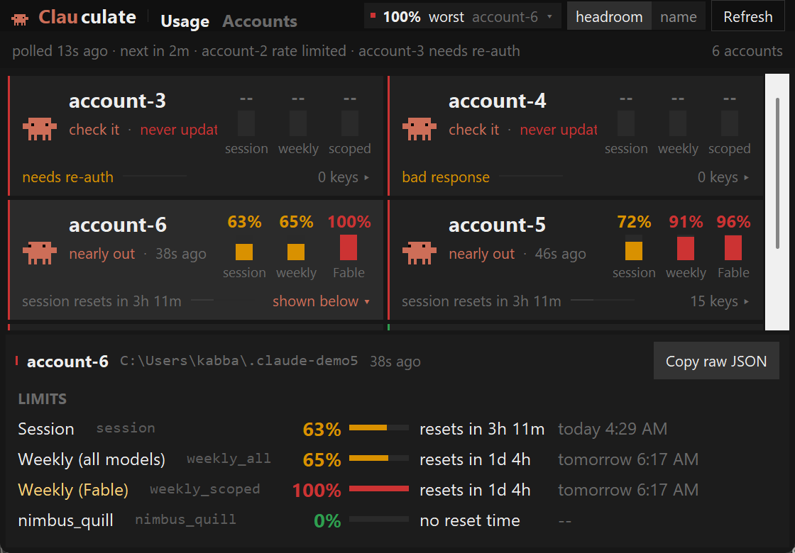
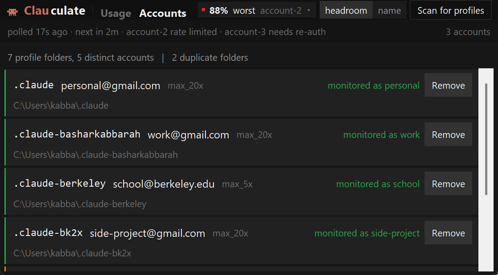

# Clauculate

A Windows tray app that shows rate-limit usage across several Claude accounts.
It reads each account's usage and displays it. Nothing else.



## Read this first

Clauculate depends on two undocumented endpoints: `/api/oauth/usage` for the
numbers and `/api/oauth/profile` for account identity. Anthropic publishes
neither, promises nothing about either, and can change or remove both without
warning. On that day the app shows you errors and raw JSON instead of numbers.

It degrades rather than lies. When the response stops matching what the parser
understands, the panel prints what arrived instead of coercing it into a
plausible zero.

## What it refuses to do

- **No inference.** It never calls a completion or messages endpoint.
- **No writes to any Claude config directory.** A runtime guard enforces this.
  See [The read-only guarantee](#the-read-only-guarantee).
- **No credential refresh.** It reads `accessToken` and stops. When a token
  expires it tells you to run `claude` yourself.
- **No account switching or routing.** The panel names the account with the
  most headroom because you want to know. The app never acts on it.
- **No impersonation.** It sends the installed Claude Code version as its
  User-Agent, read from that install's `package.json`.

## Setup

### 1. Give each account its own profile directory

Claude Code keeps credentials per `CLAUDE_CONFIG_DIR`. Point it somewhere new,
sign in, and check who landed. One account at a time, in PowerShell:

```powershell
$env:CLAUDE_CONFIG_DIR = "$env:USERPROFILE\.claude-work"
```

```powershell
claude.cmd auth login --email you@example.com
```

```powershell
claude.cmd auth status --text
```

```powershell
$env:CLAUDE_CONFIG_DIR = $null
```

Three traps, in the order you will hit them:

**Your browser hands back the wrong account.** The OAuth flow reuses whatever
claude.ai session already exists, so your second login re-grants the first
account and you end up with a duplicate. Sign out of claude.ai first, or run
the login from a private window. Step 3 catches it: if the email that comes
back differs from the one you typed, redo the login with a clean browser.

**Forgetting step 1 signs you out.** Run `auth login` without setting
`CLAUDE_CONFIG_DIR` and it overwrites your default `~/.claude` profile.

**PowerShell blocks the `.ps1` shim.** On a default execution policy, `claude`
fails to load. Call `claude.cmd`, which execution policy does not govern.

The Accounts tab automates all of this once the app runs.

### 2. Write `accounts.json`

Copy `accounts.json.example` and edit it. Forward slashes work, and so does
`%USERPROFILE%`.

```json
[
  { "label": "personal", "config_dir": "%USERPROFILE%/.claude" },
  { "label": "work",     "config_dir": "%USERPROFILE%/.claude-work" }
]
```

Keep tokens out of this file. Clauculate reads each profile's credential store
at poll time, and rejects any config carrying a `token` key.

One account can own several profile directories. Two directories holding the
same login double-count that account and burn its rate limit on duplicate
calls. The Accounts tab flags this for you.

### 3. Run it

```bash
python run.py
```

Grab `Clauculate.exe` from
[Releases](https://github.com/bkabbarah/clauculate/releases) to skip the Python
install. Flags worth knowing:

- `--once` prints a text report for every account and exits, no GUI.
- `--accounts PATH` points at a different config file.
- `--verbose` writes debug logging to the console and the logfile.

## What you get

**The tray icon** takes its colour from the worst utilization across your
accounts: green below 50%, amber to 80%, red above. Hover for one line per
account. Windows caps that tooltip at 128 characters, so Clauculate shortens
long labels to keep every account visible, and says how many it dropped when
even that fails.

**The panel** opens when you click the icon. Accounts sit on a two-column
board. Each tile carries session, weekly, and model-scoped columns beside a
freshness stamp, and selecting one fills the drawer underneath with everything
the endpoint returned for that account, including keys this build has never
seen.

The drawer names every limit twice: a readable title, and the raw key beside it
in grey. A renamed or new key stays visible rather than hiding behind a
friendly label. Reset clocks appear two ways, `resets in 2h 14m` next to
`tomorrow 5:15 AM`, converted from UTC through the OS timezone rules so DST
lands right. **Copy raw JSON** covers the day the schema moves.

The app bar holds a chip that cycles worst, average, and most free when you
click it, plus a sort toggle for the board. Under it a status strip names the
last poll, the next one, and any account in trouble.

**Clawd**, the pixel crab, reports the same state a second way. His pose tracks
the account rather than decorating it:

| Pose | Meaning |
|---|---|
| plenty left | under 25% |
| comfortable | 25 to 50% |
| working | 50 to 80% |
| running low | 80 to 95% |
| nearly out | 95% and up |
| waiting | rate limited, or the data went stale |
| check it | auth, network, or shape failure |


## The Accounts tab



**Scan for profiles** walks every `~/.claude*` directory holding a credential
store, asks `/api/oauth/profile` who owns each one, and lists what it found.
Add a profile to the monitor or drop it, and Clauculate suggests a label from
the email's local part.

The tab exists because a profile directory tells you nothing about which
account lives in it. Clauculate dedupes on `account.uuid` and paints the extra
folders amber, so you catch a doubled account on the screen rather than in your
rate limit a week later.

**It cannot sign you in.** A login means handling your password and writing a
credential file, and this app does neither. It builds the right command for
your shell, copies it, and opens a terminal with `CLAUDE_CONFIG_DIR` set. You
run the login and approve it in the browser. Claude Code writes the
credentials. The next scan picks up the new profile.

Add and Remove touch `accounts.json` and nothing else. Removing an account
stops the polling. Your folder and your login survive untouched.

## How it polls

Clauculate never polls an account faster than every 180 seconds. `--interval`
raises that floor and cannot lower it. It staggers accounts across the window
so five of them never fire together, and it sends one request per poll with no
retries, because retrying is what earns you a 429 in the first place.

When a 429 does arrive, that account backs off for 3 minutes, then 6, then 12,
then 15 as a ceiling, and honours a longer `Retry-After` when the server sends
one. The row shows the countdown and marks any figures still on screen as
coming from the last good poll.

Every outcome lands in a rotating logfile at
`%LOCALAPPDATA%\Clauculate\monitor.log`.

## History

The endpoint returns a snapshot with no past, so Clauculate builds its own in
`%LOCALAPPDATA%\Clauculate\history.sqlite3`. Each successful poll writes a row
per window and per `limits[]` entry. Rows older than 90 days get pruned at
startup and once a day after that.

## The read-only guarantee

Clauculate claims it never writes inside a Claude config directory. Three
things back that up.

**A runtime guard.** `readonly_guard` replaces `builtins.open` and `os.open`
before anything opens a file. Any write-mode call landing inside a protected
root raises `ReadOnlyViolation`. Protected roots cover every configured
`config_dir` plus every `~/.claude*` directory present at startup.

**No shelling out to the CLI.** Running `claude mcp list` against an empty
config dir creates a `.claude.json` inside it. Clauculate reads
`.credentials.json` from disk and takes its User-Agent from the installed
`package.json`, so it never launches the binary.

**A test that checks.** `tools/verify.py` hashes every file under every
configured config directory, contents and mtime both, runs a live poll cycle,
hashes again, and diffs. Then it attempts a write and asserts the guard stopped
it.

```bash
python tools/verify.py
```

On the development machine with 5 accounts configured:

```
[1] read-only guarantee
      hashed 2879 files across 5 config dirs
  PASS   no file contents or mtimes changed (2879 checked)
  PASS   no files created in any config dir
  PASS   no files removed from any config dir
  PASS   guard raised ReadOnlyViolation on an explicit write attempt
  PASS   probe file was never created on disk
  PASS   guard also blocks the low-level os.open write path
  PASS   os.open probe file was never created either

======================================================================
32 checks, 0 failed
```

The same suite covers the 429 backoff schedule, DST conversion across a
spring-forward boundary, an invented window key the code has never seen, and
six malformed responses.

## The response, as observed

Captured 2026-08-21 from Claude Code 2.1.239 on a Max plan. The schema most
write-ups describe is out of date: the live response carries a `limits[]` array
and a `spend` block that they omit.

```jsonc
{
  "five_hour":  { "utilization": 19.0, "resets_at": "...", "limit_dollars": null,
                  "used_dollars": null, "remaining_dollars": null },
  "seven_day":  { "utilization": 48.0, "resets_at": "...", ... },

  // Present, null on this plan. Names as returned.
  "seven_day_opus": null, "seven_day_sonnet": null, "seven_day_oauth_apps": null,
  "seven_day_cowork": null, "seven_day_omelette": null, "tangelo": null,
  "iguana_necktie": null, "omelette_promotional": null, "cinder_cove": null,
  "amber_ladder": null,
  "nimbus_quill": { "utilization": 0.0, "resets_at": null, ... },

  "extra_usage": { "is_enabled": false, "monthly_limit": null, "used_credits": null,
                   "utilization": null, "currency": null, "decimal_places": null,
                   "disabled_reason": null, "user_disabled": false,
                   "spend_limit_reached": false, "credits_ever_enabled": false,
                   "daily": null, "weekly": null },

  "limits": [
    { "kind": "session",       "group": "session", "percent": 19, "severity": "normal",
      "resets_at": "...", "scope": null, "is_active": false },
    { "kind": "weekly_all",    "group": "weekly",  "percent": 48, "severity": "normal",
      "resets_at": "...", "scope": null, "is_active": false },
    { "kind": "weekly_scoped", "group": "weekly",  "percent": 88, "severity": "warning",
      "resets_at": "...", "is_active": true,
      "scope": { "model": { "id": null, "display_name": "Fable" }, "surface": null } }
  ],

  "spend": { "used": { "amount_minor": 0, "currency": "USD", "exponent": 2 },
             "limit": null, "percent": 0, "severity": "normal", "enabled": false, ... },
  "member_dashboard_available": false
}
```

Ten of the fourteen top-level window keys came back null, several under
internal codenames. Hard-coding that list would break on the next release, so Clauculate
enumerates keys at runtime and renders whatever arrives.

### How it sorts the keys

Shape decides, never the name:

| Shape | Rendered as |
|---|---|
| dict carrying both `utilization` and `resets_at` | a window row with a bar |
| list of dicts carrying `percent` or `kind` | limit rows, with scope labels |
| any other dict or list | a flattened key/value block |
| a scalar | one key/value row |
| `null` | listed under "reported but null" |

Requiring both `utilization` and `resets_at` matters. `extra_usage` carries a
`utilization` key with no reset clock, and belongs in its own block.

### Fable

The endpoint does expose Fable, inside `limits[]` rather than as a top-level
window key. Look for `kind: "weekly_scoped"` with
`scope.model.display_name: "Fable"`, carrying its own `percent`, `severity`,
and `resets_at`. Clauculate gives it a row under LIMITS like any other limit.

What the endpoint withholds: whether that percentage measures a Fable sub-cap
or the whole weekly pool. Clauculate reports it as the model's scoped cap and
draws no further conclusion. It infers no relationship between the Fable number
and the weekly number, because the endpoint exposes none.

Should a future response omit the scoped entry, the panel says so rather than
inventing a Fable row.

## Platform support

**Windows works.** Everything here ran on Windows 11 with Claude Code 2.1.239.

**macOS and Linux remain unverified.** Response parsing, polling, backoff,
history, the read-only guard, and the test suite are plain Python and carry
over. Paths resolve per platform, and the Accounts tab emits shell-appropriate
commands and opens Terminal.app on macOS.

Someone with a Mac needs to check three things before anyone claims it runs:

1. **Where the credentials live.** Clauculate reads `.credentials.json` from
   the profile directory. Claude Code's `--bare` flag documents skipping
   "keychain reads", which suggests macOS keeps OAuth tokens in the login
   Keychain instead of a file. If so, `credentials.py` needs a Keychain reader
   before anything works. This blocks the rest.
2. **Tray threading.** The macOS `pystray` backend wants the main thread, and
   so does Tk. Today Tk owns main and the tray runs on a worker, which suits
   Windows and Linux.
3. **The build.** PyInstaller cannot cross-compile, so a `.app` comes off a
   Mac.

Pull requests welcome. A clean import proves nothing.

## Building the exe

```bash
python -m PyInstaller --noconfirm Clauculate.spec
```

`dist/Clauculate.exe` comes out the other side. Keep `accounts.json` beside the
exe, which reads it at runtime rather than bundling it.

## Layout

```
run.py                     entry point
accounts.json.example      config template
src/claude_usage/
  readonly_guard.py        open() and os.open() interception
  credentials.py           read-only credential access, token never logged
  poller.py                HTTP, staggering, TTL floor, 429 backoff
  model.py                 shape-based classification of the response
  panel.py                 the detail window
  accounts_tab.py          profile discovery and enrollment
  profile.py               account identity and duplicate detection
  tray.py                  tray icon and tooltip
  clawd.py                 sprite data and mood mapping
  store.py                 SQLite history
tools/
  verify.py                the verification suite
  demo_panel.py            render the panel with synthetic accounts
  demo_accounts.py         render the Accounts tab (--redact for screenshots)
```

## Credits

Clawd comes from the [clawd-animation skill](https://mmguo.dev/clawd/) by
mmguo. Clauculate ports the sprite data, the body matrix, eye variants,
anchors, and `#CD6E58`, onto a Tk canvas. The skill draws the same pixel grid
to an HTML canvas.

This README follows [stop-slop](https://github.com/hvpandya/stop-slop) by
Hardik Pandya.
